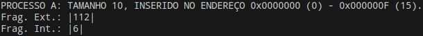

# Sistemas Operacionais T2 – Gerenciamento de Memória


## Documentação do Programa:

Este programa tem como objetivo a construção de um sistema de gerenciamento de memória que através de simples instruções em um arquivo de texto, realiza operações de alocação e desalocação de processos abstraídos apenas a seu nome e tamanho.

O arquivo de instruções, para ser lido pelo programa, necessita estar no formato `IN(<nome_do_processo>,<tamanho_de_unidades_do_processo>)` (eg. `IN(A,15)`) para inserção, e `OUT(<nome_do_processo>)` (eg. `OUT(A)`) para remoção, cada uma separada por linhas, deste modo:

```IN(A,3)
IN(B,2)
OUT(A)
IN(C,1)
OUT(B)
OUT(C)
```


### Para compilar:  
**Linux:** Execute o comando “make” no terminal do diretório raiz (mesmo que contém o arquivo “Makefile”) para realizar a compilação.  
**Windows:** Com o compilador MingW32 instalado, digite “mingw32-make -f Makefile” no cmd no diretório raiz (mesmo que contém o arquivo “Makefile”) para realizar a compilação.  
(Este programa não foi testado extensivamente em Windows)

### Para executar:  
Para executar a nossa solução, é necessário digitar parâmetros na inicialização no terminal, desta forma:  
```
$ ./<executável_do_programa> -i <nome_do_arquivo_de instruções> -m <tamanho_da_memoria> -s <nome_da_estrategia> -d <nivel_debug(0-2)>
```  
Não necessariamente nesta ordem, ainda que os valores devam ser digitados a seguir de cada flag. Caso algum destes parâmetros não seja incluído, o programa pedirá ao usuário para que os insira, com exceção do parâmetro de debug que, por padrão, e se não incluído nos parâmetros, é inicializado em 0.

### Descrição de cada parâmetro:  
`<executável_do_programa>` No Linux compilado para sisop_t2, e sisop_t2.exe no Windows.  
`<nome_do_arquivo_de instruções>` Deve estar contido no diretório raiz.  
`<tamanho_da_memoria>` Valor do tamanho de memória, necessário ser potência de 2 (eg. -m 128).  
`<nome_da_estrategia>` Nome da estratégia, case-insensitive (Buddy, Circular, Worst) ou apenas a primeira letra (b, c, w) (eg. -s b).  
`<nivel_debug(0-3)>` Nível de debug, em que 1 são impressos os blocos de forma visual, e em 2 também são impressos os nodos da árvore (Buddy) ou da lista (Circular-fit, Worst-fit)  (eg. -d 2).

### Níveis de debug:  
Debug 0:  
  
Impressão apenas de fragmentos livres de memória contíguos, representando fragmentação externa. No caso da estratégia Buddy também é apresentada a fragmentação interna.


Debug 1:  
  
Impressão adicional de blocos alocados em branco, e os demais, escuros, de memória livre. Na estratégia Buddy (imagem acima), a fragmentação interna tem uma cor diferente, mais escura, em relação aos blocos alocados pelo processo, visto serem inutilizáveis por outros.

Debug 2:  
  
Impressão do debug 1 com a inclusão de uma visualização da abstração da memória física em unidades de bytes (8bits, 2hex) alocados na memória. Ainda que exista esta array em que os bytes são modificados, o efeito é apenas visual, utilizando valores 0-255 aleatórios, visto que os processos também não são reais.

Debug 3:  
  
Impressão do debug nível 1 com adicional dos nodos (por nível, no caso da árvore), indicando seu endereço (eg 0-127). Caso seja uma folha (LEAF), pode ser alocado. H denota que está livre, e P que está alocado por um processo de id após o hífen (eg. P-0).  
Caso seja uma lista, ficará assim, em apenas uma linha:  


### Exemplo de execução:
Executando ./sisop_t2 -i ex1.txt -m 128 -s worst -d 1, por exemplo, fará o programa utilizar o arquivo de texto ex1.txt no diretório do programa, com uma memória total de 128 unidades, com estratégia Worst-fit e nível de debug 1.  
Neste exemplo, o programa se comporta desta maneira:  


